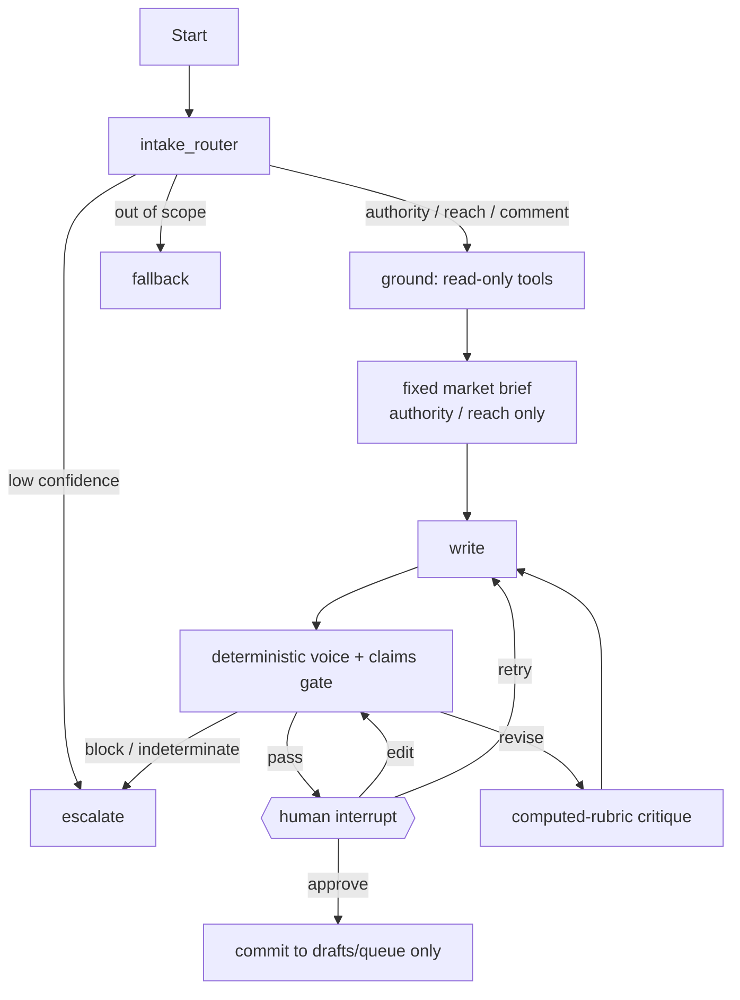

# Agentic harness architecture

## One-liner

This agent turns a rough LinkedIn idea into a voice-matched, evidence-grounded
draft in a local Streamlit app. It retrieves, drafts, and critiques on its own,
but cannot queue a file until a human explicitly approves it. An ungrounded claim
hard-stops rather than being automatically rewritten.

## Workflow



The editable Mermaid source is [architecture.mmd](architecture.mmd).

## Safety properties

- The only writer is `commit`, which is downstream of `interrupt()` and accepts
  only an explicit `approve` action with a passing gate report.
- `queue_draft` is not a LangChain tool. The grounding ReAct agent receives only
  five read tools, so an LLM cannot choose to write.
- `pipeline.claims` parses only verified five-column truth-table rows and verified
  story metrics. It ignores frontmatter, review notes, years, and list numbering.
- Voice scoring fails closed when the fingerprint has fewer than three samples,
  fewer than 1,500 words, or no features.
- Market intel can degrade. Empty stories, an ungrounded claim, an indeterminate
  gate, or a revision-loop cap escalates instead of silently proceeding.
- Live market search is unscored and runs once, after grounding, only for `authority`
  and `reach`. It is cached for 12 hours and can shape length, structure, and angle;
  it is never added to the factual allowlist or supplied as phrasing to the writer.
- The market brief retains only scalar structure signals and five compressed hooks for
  human review. Its full-post source text never enters writer context, and the claims
  gate remains the final authority over every number and superlative.

## Failure policy

| Class | Handling |
| --- | --- |
| `TRANSIENT` | Retry twice with exponential backoff. |
| `DEGRADABLE` | Continue with an explicit flag; empty market intel is an example. |
| `CAPABILITY` | Escalate immediately; an empty story index cannot be repaired by retrying. |
| `INTEGRITY` | Hard-stop and expose the ungrounded span. |
| `LOOP` | Escalate after three writer revisions with full history retained. |

## Operating the project

```bash
uv sync --extra dev
uv run pytest
uv run python evals/run.py
uv run streamlit run app.py
```

The eval run uses only `tests/fixtures/dev_corpus/`. Before a real run, populate
the ignored `private/` corpus exactly as described in Week 3 Phase K, then run
`uv run python pipeline/voice.py fingerprint` and repeat the evals.

## Demo run sheet

1. Show a clean grounded fixture draft reaching the human-review interrupt.
2. Enter an invented metric; show the unmatched span and integrity stop.
3. Set `FAULT_SEARCH_500=1` or `FAULT_EMPTY_INDEX=1`; show the recorded error
   and escalation/degradation behavior.
4. Run `evals/run.py` and show the transparent known limitation for verbal
   number laundering.
