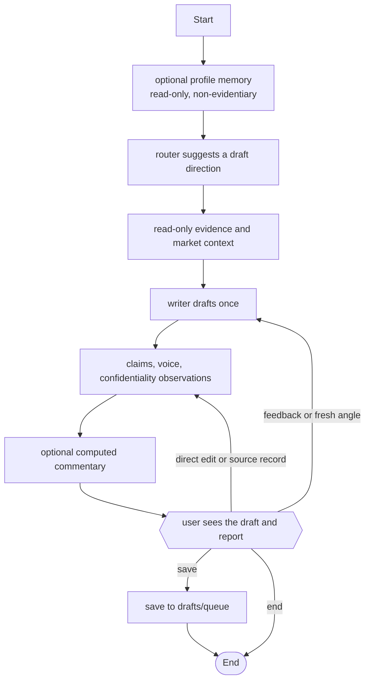

# Collaborative drafting architecture

## Why this design changed

This project began with fail-closed gates and automatic revision paths. After first real use,
that proved counterproductive: a tool that blocks constantly gets deleted. The checks are still
valuable because they show exactly what was and was not grounded, but they now advise the person
writing instead of deciding for them.

LinkedIn Content OS is therefore a local collaborative drafting tool. It makes one draft, reports
its observations, and waits for the user to decide what happens next. It never blocks, escalates,
or automatically loops to revise.

## Workflow



The editable Mermaid source is [architecture.mmd](architecture.mmd).

The router, empty story index, market lookup, profile memory, and model service can all be
unavailable. Each condition becomes a `degradation_reasons` note and the flow continues to the
draft. The offline writer is deliberately transparent about an instruction it cannot safely
interpret; it never invents an edit.

## Observations, not gates

Detectors retain their full strength and report their original detail:

- Claim detection reports every numeric, superlative, and attribution span, its kind, sentence,
  and line number. The report splits detected claims into grounded and not grounded.
- Voice detection reports profile readiness, feature differences, and banned tells in plain
  language. It does not route the draft anywhere.
- Confidential-term detection reports every literal match and its line numbers.
- Market context is structural context only. It cannot become factual evidence.

The Streamlit observations panel displays all of this alongside the draft. An ungrounded claim
can be recorded with a claim, proof, date, and explicit `yes` verification entered by the user.
Only those exact user-entered field values are appended to
`private/identity/truth-table.md`; the app never fills them in.

## Conversational revision

The user can type feedback in plain language below a draft. The writer receives it as **User
directions**, ahead of computed observations, together with the previous draft. User directions
persist for the entire conversation so successive requests compose on the current draft; when two
directions conflict, the newest direction takes precedence. A fresh-angle request also retains
the previous draft in writer context. There is no revision cap and no automatic rewrite.

Computed critique is still useful as optional commentary. It is created once after the checks and
cannot control graph routing or instruct the writer on its own.

## Saving and provenance

Saving is always available when the user selects **Approve & queue**. It is not conditional on a
claim, voice, confidentiality, or market observation. The saved queue artifact records the draft
and its hooks plus an honest snapshot of what was known at save time:

- grounded and not-grounded claim observations, including sentences, spans, kinds, and lines;
- voice, confidential-term, and market reports;
- unresolved claim spans, any degradation notes, and user annotations.

Nothing publishes, sends a message, or changes the private corpus automatically. `commit` writes
only the selected review artifact under `drafts/queue/`; recording a truth-table source is the
only private write and it accepts only text supplied by the user.

## Evidence and privacy boundaries

`private/` is ignored and is the source for a personal corpus. `corpus/` holds tracked templates;
`intel/` contains disposable market research. The read-only grounding tools retrieve verified
truth-table rows and verified story metrics. Personal memory is optional, non-evidentiary framing
and never expands the factual allowlist. It is withheld from model prompts if LangSmith tracing is
enabled without separate approval.

<!-- audit-accept: agent/config.py:MEM0_ALLOW_LANGSMITH_TRACING -->

Market intelligence is optional, bounded, cached structural guidance for authority and reach
drafts. It is never added to the allowlist and never supplies wording for a factual claim.

## Evaluation and local commands

```bash
uv sync --extra dev
uv run pytest -q
uv run ruff check . --exclude .venv
uv run python scripts/audit.py
uv run python evals/run.py
uv run streamlit run app.py
```

Fixture evaluations use only `tests/fixtures/dev_corpus/`. They report planted-claim recall,
claim precision on clean drafts (including hyphenated-compound cases), and whether every case
produced a draft that reached the user. They do not calculate refusal, containment, or safety
rates, because the product does not refuse or contain drafts.
