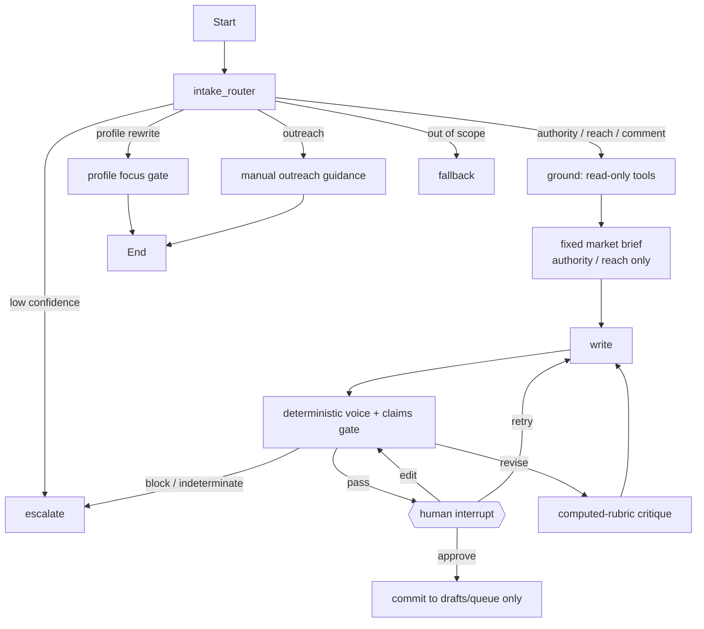

# Agentic harness architecture

## One-liner

This agent turns a rough LinkedIn idea into a voice-matched, evidence-grounded
draft in a local Streamlit app. Nebius Token Factory supplies optional live models
through its OpenAI-compatible API. It retrieves, drafts, and critiques on its own,
but cannot queue a file until a human explicitly approves it. An ungrounded claim
hard-stops rather than being automatically rewritten.

## Workflow



The editable Mermaid source is [architecture.mmd](architecture.mmd).

## Safety properties

- The only writer is `commit`, which is downstream of `interrupt()` and accepts
  only an explicit `approve` action with a passing gate report.
- `queue_draft` is not a LangChain tool. The grounding ReAct agent receives only
  five read tools, so an LLM cannot choose to write.
- `pipeline.claims` parses only verified five-column truth-table rows and verified
  story metrics. It ignores frontmatter, review notes, years, and list numbering.
- Voice scoring fails closed when the fingerprint has fewer than three samples,
  fewer than 1,500 words, or no features.
- Market intel can degrade. Empty stories, an ungrounded claim, an indeterminate
  gate, or a revision-loop cap escalates instead of silently proceeding.
- Live market search is unscored and runs once, after grounding, only for `authority`
  and `reach`. It is cached for 12 hours and can shape length, structure, and angle;
  it is never added to the factual allowlist or supplied as phrasing to the writer.
- The market brief retains only scalar structure signals and five compressed hooks for
  human review. Its full-post source text never enters writer context, and the claims
  gate remains the final authority over every number and superlative.
- `agent.skills` loads authored role playbooks from `.claude/skills/` at prompt construction
  time. They set process and structure, never evidence; they cannot widen the allowlist or
  override a gate.
- A profile-rewrite request first mines five or more JDs. If the percentage of significant terms
  appearing in four or more JDs is below 0.75, the graph names the role clusters and stops before
  drafting profile copy.
- Outreach is read-only guidance over `ops/outreach-log.md` and
  `ops/engagement-queue.md`. It requires an application first and never searches people, sends a
  message, schedules engagement, or writes an account/person record.

## Failure policy

| Class | Handling |
| --- | --- |
| `TRANSIENT` | Retry twice with exponential backoff. |
| `DEGRADABLE` | Continue with an explicit flag; empty market intel is an example. |
| `CAPABILITY` | Escalate immediately; an empty story index cannot be repaired by retrying. |
| `INTEGRITY` | Hard-stop and expose the ungrounded span. |
| `LOOP` | Escalate after three writer revisions with full history retained. |

Live model calls use a single bounded request (`LLM_TIMEOUT_SECONDS`, default 180 seconds) with
no client-side retries. A provider stall becomes a capability escalation, rather than an
unbounded paid request. This is deliberately separate from the 25-second optional market-intel
timeout. The observational grounding ReAct trace is off by default because deterministic retrieval
does not consume its output; enable it only when diagnosing tool behavior.

LangChain and LangGraph send dashboard traces to LangSmith when `LANGSMITH_TRACING=true` and a
`LANGSMITH_API_KEY` are configured. Set `LANGSMITH_PROJECT` to isolate this application’s runs.
Tracing exports prompts and outputs to that external service, so enable it only with explicit
approval for the corpus-derived material that will be observed there.

## Model and market configuration

The default test path is offline. For Nebius Token Factory, configure a local `.env` with an
OpenAI-compatible base URL, the environment-variable name containing the Nebius key, and selected
router/writer/critic model IDs. Text embeddings use the same endpoint and key; set
`EMBED_MODEL_OVERRIDE` to an enabled embedding model. Do not place credentials in tracked files.
Set `LLM_SEED` only after confirming that the selected provider accepts the OpenAI-compatible
`seed` parameter; it is forwarded unchanged to model requests and does not replace the gates.

Market intel has two distinct paths:

1. The batch watchlist pull writes local raw and normalized post records, then calculates an
   x-factor only when an author has at least ten self-excluded recent posts.
2. The in-graph live search is unscored, optional, cached, and restricted to authority/reach
   intent. It can shape an angle but is never evidence for a factual claim.

Build market templates after a batch pull with `pipeline/embed.py market --allow-network` and
`pipeline/cluster.py text`. Missing templates degrade grounding explicitly; they never bypass the
claims or voice gate.

## Operating the project

```bash
uv sync --extra dev
uv run pytest
uv run python evals/run.py
uv run streamlit run app.py
```

The eval run uses only `tests/fixtures/dev_corpus/`. Poison cases report three distinct safe
outcomes: prevention (the writer omitted the poisoned premise), defense (the deterministic gate
blocked an emitted claim), and containment (the run escalated before approval). The metric never
rewards weakening a gate to force a block.

Before a real run, populate the ignored `private/` corpus, then run
`uv run python pipeline/voice.py fingerprint` and repeat the evals.

## Demo run sheet

1. Show a clean grounded fixture draft reaching the human-review interrupt.
2. Enter an invented metric; show the unmatched span and integrity stop.
3. Set `FAULT_SEARCH_500=1` or `FAULT_EMPTY_INDEX=1`; show the recorded error
   and escalation/degradation behavior.
4. Run `evals/run.py` and show the transparent known limitation for verbal
   number laundering.
